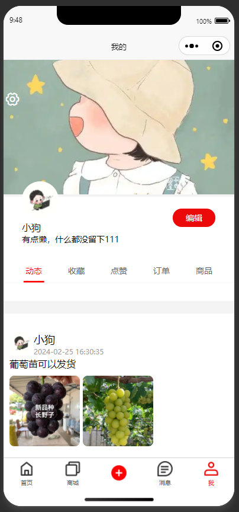
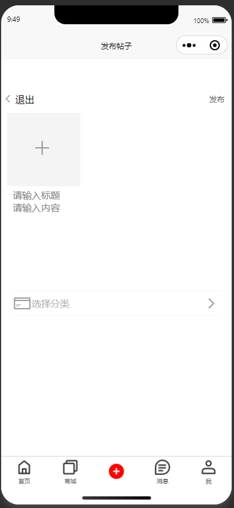

# 基于Java+Springboot+Vue农友圈小程序-毕业设计

# 获取地址

#### 作者QQ：3275035005 微信：xkbishe123 (支持修改、 部署调试、 代做接毕业设计和课程设计)

#### 网站建设、小程序、H5、APP、各种系统、样式修改、10000套源码可选。

#### 选题+开题报告+任务书+程序定制+安装调试+论文+答辩ppt 都可以做

#### 问题包修改，包满意，有需求尽管甩过来！一条龙帮你安心过！

#### 所有项目以及源代码本人均调试运行无问题 可支持远程调试运行

# 项目介绍
基于Java+Springboot+Vue农友圈小程序-毕业设计，本系统分微信小程序和管理后台两部分，项目采用前后端分离

可选题目：农友圈小程序、基于SpringBoot农友圈小程序、基于Web农友圈小程序

### 1. 用户

用户登录注册、首页帖子查看、首页帖子搜索、帖子收藏、帖子评论、帖子点赞、商城商品发布、商品加入购物车、商品购买、联系客服、发布帖子、发送消息、个人资料修改、更改头像、更改主页封面、查看个人动态、查看我的收藏、查看我的点赞、查看我的订单、查看发布商品、密码修改、退出登录

###  2. 管理员

管理员登录，帖子信息：分页查询、删除，帖子分类信息：分页查询、新增、修改、删除，商品信息：分页查询、删除，分类分类信息：分页查询、新增、修改、删除，商品订单信息：分页查询、发货、删除，农民信息管理：分页查询、新增、修改、删除，个人中心：修改，密码修改，退出登录

# 技术框架
- 开发语言：Java 
- 数据库：Mysql 
- 系统环境：jdk8、maven、node
- 后端框架：SpringBoot、MyBatisplus、MyBatis
- 前端框架：Vue、Elementui、微信小程序
- 小程序：Uniapp
- 工具：IDEA、Navicat、微信开发者工具、HBuilder
- 技术架构：前后端分离、B/S架构、MVC架构
# 项目截图

### 1. 微信端

### 2. 管理端

